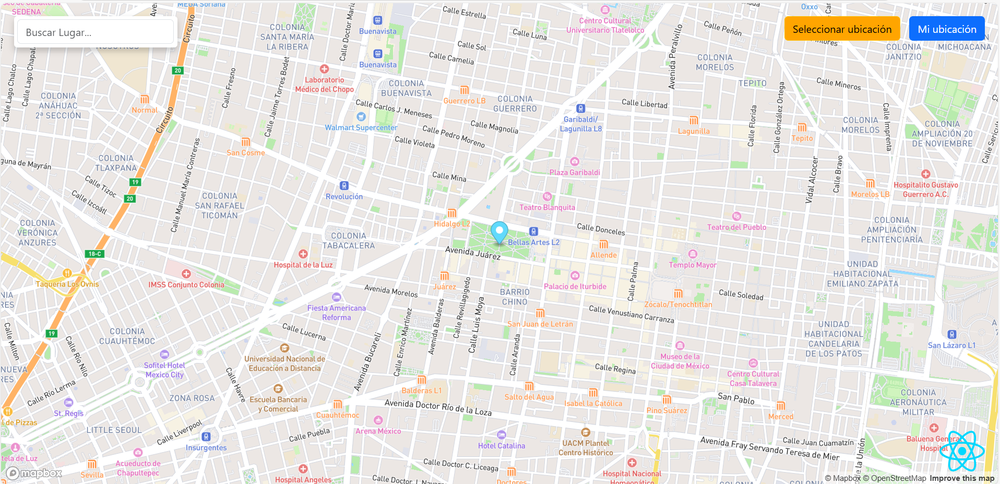
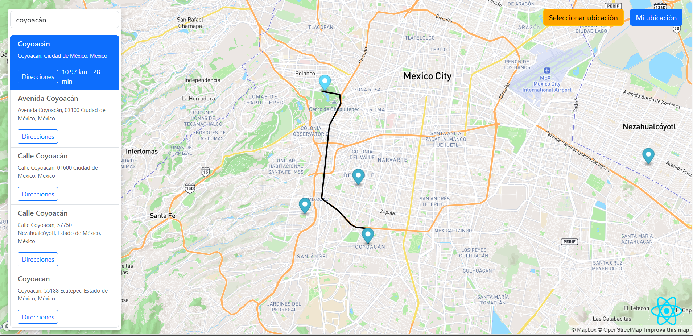
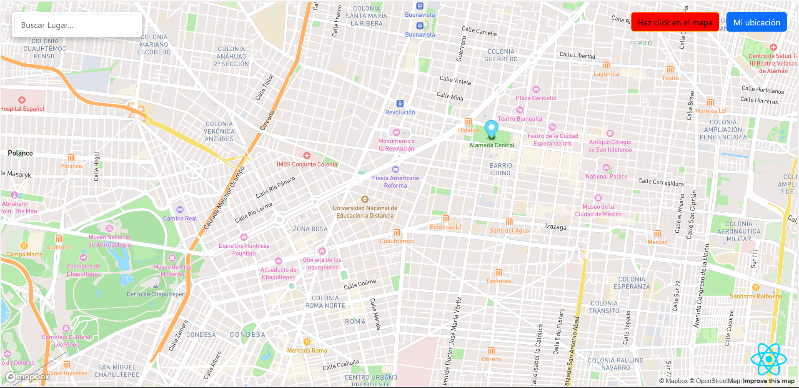

# 🗺️ Maps App con React.js

Una aplicación interactiva de mapas construida con React.js, TypeScript y Vite. Permite al usuario explorar lugares, obtener direcciones y visualizar rutas en un mapa interactivo.

## 🔹 Demo en vivo

> 👉[Puedes ver la aplicación funcionando aquí ](https://maps-app-reactjs.netlify.app/)

## 🚀 Características

- **Mapa interactivo**: Visualiza ubicaciones y direcciones en un mapa dinámico.
- **Búsqueda de lugares**: Encuentra lugares cercanos y selecciona ubicaciones en el mapa.
- **Direcciones**: Obtén direcciones entre tu ubicación y otros lugares.
- **Modo de selección**: Activa el modo de selección para elegir una ubicación en el mapa.
- **Distancia y tiempo**: Visualiza kilómetros y minutos de ruta al lado del botón de direcciones.

## 📸 Capturas de pantalla

## 🛠️ Tecnologías utilizadas

- **React.js**: Biblioteca para construir interfaces de usuario.
- **TypeScript**: Superset de JavaScript que agrega tipado estático.
- **Vite**: Herramienta de construcción rápida para proyectos de frontend.
- **Mapbox GL JS**: Biblioteca para renderizar mapas interactivos.
- **Axios**: Para realizar llamadas HHTP a APIs.
- **Bootstrap 5**: Estilos CSS y componentes listos para usar.
- **React Context API**: Manejo de estado global para compartir datos entre componentes.

## 🧪 Cómo usar

1. Mi ubicación: Botón para centrar el mapa en tu ubicación actual.

2. Seleccionar ubicación: Activa el modo de selección y haz click en el mapa para definir tu ubicación.

3. Direcciones: Haz click en un lugar y luego en "Direcciones" para trazar la ruta.

4. Resultados de búsqueda: Visualiza lugares cercanos con distancia y tiempo al lado del botón de direcciones.

## 👨‍💻 Autor

**Ulises Isais**
